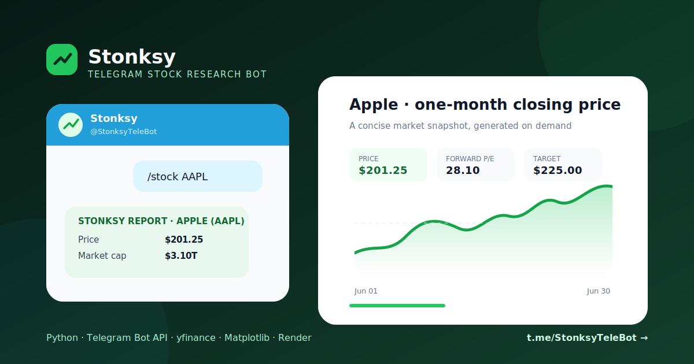
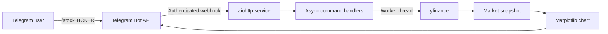

# Stonksy

**A deployed Telegram bot that turns a ticker symbol into a concise market snapshot.**

[](https://t.me/StonksyTeleBot)
[](https://www.python.org/)
[](https://github.com/anand2273/stocksnap/actions/workflows/ci.yml)

<p align="center">
  <a href="https://t.me/StonksyTeleBot">
    
  </a>
</p>

## What it does

Send Stonksy a command such as `/stock AAPL`. It responds with:

- Current price, market capitalization, and valuation ratios
- 52-week range, earnings per share, and analyst target price
- A generated one-month closing-price chart
- Up to three recent company news links
- A direct link to the ticker on Yahoo Finance

The bot is deployed as an authenticated Telegram webhook on Render. Blocking market-data and
chart work runs outside the asynchronous event loop so other updates remain responsive.

**[Open Stonksy in Telegram →](https://t.me/StonksyTeleBot)**

## Architecture



## Commands

| Command | Description |
| --- | --- |
| `/start` | Introduces Stonksy and shows an example |
| `/help` | Shows usage and market-data notes |
| `/stock <ticker>` | Generates a stock snapshot, for example `/stock MSFT` |

## Technology

- Python 3.13
- `python-telegram-bot` for commands and update processing
- `aiohttp` for the webhook and health endpoint
- `yfinance` for market information
- Matplotlib for in-memory chart generation
- Render Blueprint for deployment
- pytest, Ruff, and GitHub Actions for automated checks

## Run locally

```bash
python3 -m venv .venv
source .venv/bin/activate
pip install -r requirements-dev.txt
cp .env.example .env
```

Set `BOT_TOKEN` in `.env`, then start the local polling client:

```bash
python main.py
```

Only one polling process can consume updates for a bot token at a time. Stop the deployed
instance or use a separate development bot when testing locally.

## Deploy on Render

The included [`render.yaml`](render.yaml) defines a free Python web service with:

- `GET /health` for platform health checks
- `POST /telegram/webhook` for authenticated Telegram updates
- A generated `WEBHOOK_SECRET`
- `BOT_TOKEN` supplied securely through the Render dashboard

Render supplies `RENDER_EXTERNAL_URL` and `PORT`; Stonksy uses them to register and serve its
webhook. Free services may sleep when idle, so the first interaction after inactivity can take
longer.

## Test

Tests mock Telegram and Yahoo Finance, so they do not need credentials or network access.

```bash
ruff check .
pytest
```

## Limitations

- Yahoo Finance data may be delayed, incomplete, or temporarily unavailable.
- Analyst targets and fundamentals are not present for every ticker.
- Stonksy is an educational project and does not provide investment advice.

## Résumé summary

> Built and deployed an asynchronous Python Telegram bot that transforms ticker commands into
> market snapshots with fundamentals, recent news, and dynamically generated price charts;
> secured production delivery through authenticated webhooks and automated quality checks.
